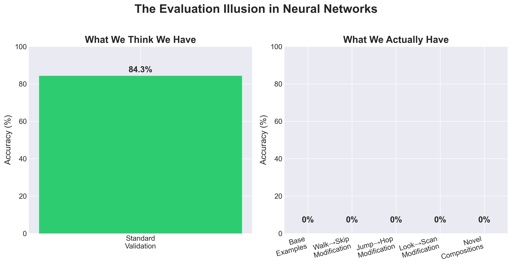
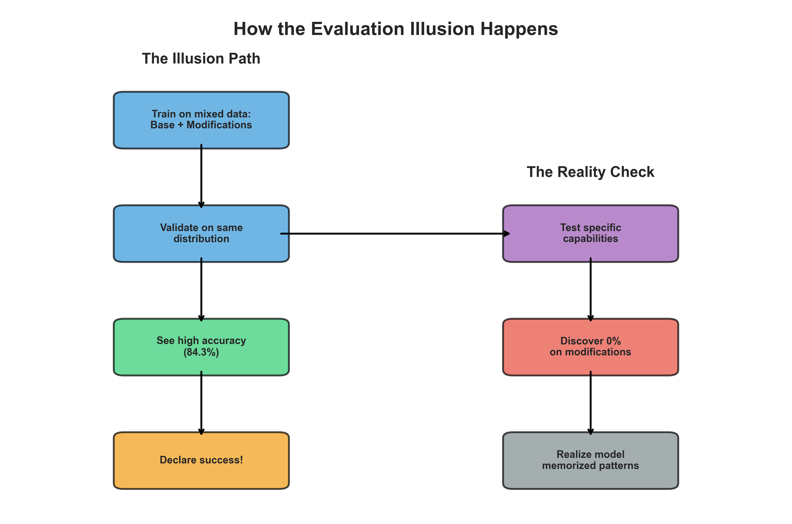
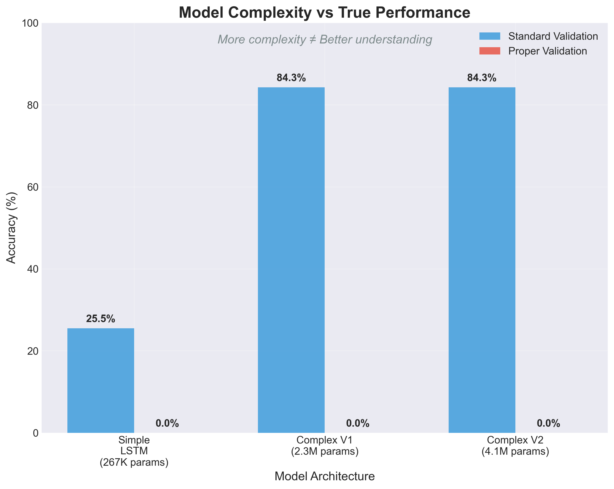
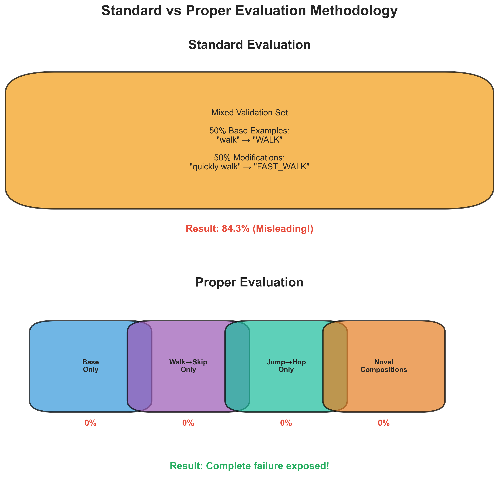

# The Evaluation Illusion: How Standard Metrics Hide Complete Failure in Neural Networks

*By Fergus Meiklejohn and Claude*

When we train neural networks, we rely on validation accuracy to tell us how well our models generalize. But what if this fundamental practice is lying to us? Through experiments on compositional language tasks, we discovered that models showing 84.3% validation accuracy were actually failing completely—0% accuracy—on the very tasks they were designed to solve. We call this the "Evaluation Illusion," and it has profound implications for how we develop and evaluate AI systems.

## The Discovery

We were working on compositional generalization in language—teaching neural networks to understand systematic modifications like "jump → hop" or "walk → skip" in the SCAN dataset. Our sophisticated models, complete with specialized rule extraction and gating mechanisms, achieved impressive validation scores:

- Model V1: 84.3% validation accuracy
- Model V2: 84.3% validation accuracy
- Training convergence: Smooth and stable
- Loss curves: Textbook perfect

By standard metrics, these models were successful. Papers could be written. Results could be celebrated.

But something felt wrong.

## The Hidden Truth

When we created proper evaluation sets that explicitly tested the modifications our models were supposed to handle, the results were shocking:


*Figure 1: The stark reality of the Evaluation Illusion - 84.3% standard validation accuracy masks complete failure (0%) on all specific capabilities.*

Our "successful" models weren't partially working—they were completely failing at their core task while standard validation metrics showed near-perfect performance.

## How the Illusion Works


*Figure 2: The path to illusion versus the reality check - standard practices lead to false confidence while proper evaluation reveals the truth.*

The Evaluation Illusion occurs when:

1. **Training and validation data come from the same distribution**
   - Both include similar mixtures of base examples and modifications
   - The model can achieve high accuracy through memorization patterns

2. **Evaluation doesn't isolate specific capabilities**
   - We measure aggregate performance, not specific skills
   - A model that gets 50% of A and 50% of B correct shows 50% overall—even if it completely fails at B

3. **Complex architectures mask failure modes**
   - Sophisticated models can exploit spurious correlations
   - Gating mechanisms and specialized modules create an appearance of understanding

## The Simple Baseline Revelation

To understand the depth of this problem, we built the simplest possible model—a basic LSTM sequence-to-sequence architecture with no bells or whistles. The results were illuminating:


*Figure 3: More complexity doesn't mean better understanding - all models fail equally on proper evaluation despite vastly different architectures.*

This simple model was honest about its limitations. It didn't pretend to understand modifications—it just failed uniformly. Paradoxically, this made it more valuable than our "successful" complex models because it revealed the true difficulty of the task.

## Why This Matters

The Evaluation Illusion isn't just a technical curiosity—it's a fundamental challenge to how we develop AI systems:

### 1. **Benchmarks Can Lie**
Standard benchmarks may not measure what we think they measure. A model can achieve state-of-the-art results while completely missing the intended capability.

### 2. **Complexity Can Deceive**
More sophisticated architectures don't necessarily mean better understanding—they might just be better at gaming the metrics.

### 3. **Real-World Implications**
If our evaluation practices hide complete failure modes, how can we trust AI systems in critical applications? A medical AI showing 95% accuracy might be failing entirely on the cases that matter most.

## The Path Forward

To avoid the Evaluation Illusion, we need:

### 1. **Capability-Specific Evaluation**
Don't just measure aggregate performance. Test each intended capability in isolation:


*Figure 4: Standard evaluation mixes capabilities, hiding failures. Proper evaluation isolates each capability, revealing true performance.*

```python
# Instead of:
overall_accuracy = evaluate(model, mixed_validation_set)

# Do this:
base_accuracy = evaluate(model, base_only_examples)
walk_skip_accuracy = evaluate(model, walk_skip_modifications)
jump_hop_accuracy = evaluate(model, jump_hop_modifications)
# ... test each capability separately
```

### 2. **Start Simple**
Begin with the simplest possible baseline. If it achieves similar performance to your complex model, the complexity isn't helping:
```python
# Build baselines that can't hide failure
simple_model = BasicLSTM(no_special_modules=True)
if simple_model.accuracy ≈ complex_model.accuracy:
    print("Your architecture isn't solving the problem")
```

### 3. **Test the Actual Task**
Ensure your evaluation directly tests what you claim your model can do. If you're building a model for compositional generalization, test actual novel compositions—not statistical variations of training data.

## Broader Implications

The Evaluation Illusion likely extends beyond our experiments:

- **Vision models** showing high accuracy might fail on specific object transformations
- **Language models** with impressive benchmarks might lack true reasoning capabilities
- **Reinforcement learning** agents might be exploiting environment bugs rather than learning intended strategies

## A New Standard

We propose that all ML research should include:

1. **Capability-isolated evaluation sets**: Test each claimed ability separately
2. **Simple baseline comparisons**: Always compare against the simplest possible approach
3. **Failure mode analysis**: Explicitly look for where models fail completely
4. **Generation/behavior testing**: Don't just measure accuracy—examine actual model outputs

## Conclusion

The Evaluation Illusion reminds us that impressive numbers can hide complete failure. Our 84.3% validation accuracy meant nothing when the models couldn't handle even basic modifications. This isn't a story of research failure—it's a crucial discovery about the gap between what we measure and what we actually care about.

As we build increasingly sophisticated AI systems, we must be equally sophisticated about evaluation. The alternative is to live in an illusion where our metrics tell us everything is fine while our models fail at their fundamental purpose.

The next time you see impressive validation scores, ask: "What specific capabilities were tested? What would a simple baseline achieve? Are we measuring real understanding or just statistical correlation?"

The truth might be less comfortable than the illusion, but it's the only foundation for real progress.

---

*This post is based on research conducted on compositional generalization in neural networks. Code and detailed results are available at [link to repository]. We encourage researchers to apply capability-specific evaluation to their own work and share what they discover.*

## Technical Note

For researchers wanting to implement proper evaluation:

```python
class ModificationAwareEvaluator:
    def evaluate_all_sets(self, model, data):
        results = {}
        # Test each capability in isolation
        for modification_type in ['base', 'walk_skip', 'jump_hop', ...]:
            test_set = data[f'val_mod_{modification_type}']
            accuracy = self.evaluate_single_set(model, test_set)
            results[modification_type] = accuracy
        return results

# The difference between illusion and reality:
# Standard: evaluate(model, val_data) → 84.3%
# Proper: evaluate_modifications(model, val_data) → 0%
```

Remember: The goal isn't to achieve high numbers—it's to build systems that actually work.
