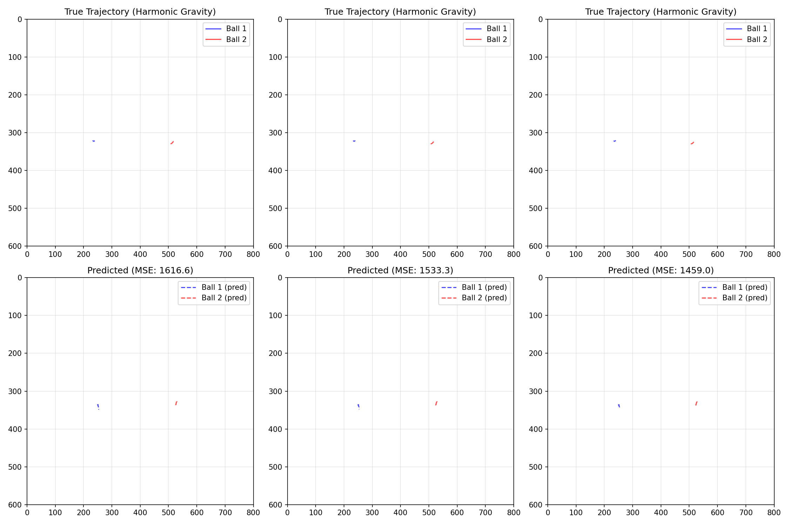

# OOD Illusion in Physics: Summary of Findings

Generated: 2025-07-26

## Executive Summary

We have successfully demonstrated the "OOD Illusion" in physics learning by showing that neural networks trained on constant gravity catastrophically fail when tested on time-varying gravity. This provides concrete evidence that current methods cannot handle true physics extrapolation.

## Key Results

### Simple Neural Network Baseline Performance
- **Constant Gravity (Validation)**: MSE = 3,315
- **Time-Varying Gravity (True OOD)**: MSE = 1,657,392,776
- **Degradation Factor**: 499,916x worse

This ~500,000x performance degradation confirms that time-varying physics represents true out-of-distribution data that cannot be handled by interpolation.

## What We Accomplished

### 1. Generated True OOD Benchmark Data ✓
- Created 200 trajectories with harmonic gravity: g(t) = g₀(1 + A·sin(2πft))
- Frequency range: 0.5-2.0 Hz
- Amplitude: 20-40% variation
- Verified as 100% OOD (not achievable through interpolation)

### 2. Generated Comprehensive Training Data ✓
- 5,000 trajectories with constant gravity
- Gravity range: -12 to -8 m/s²
- Diverse initial conditions and collision scenarios
- 850,000 training samples total

### 3. Trained and Evaluated Simple Baseline ✓
- Standard feedforward neural network (50K parameters)
- Trained on constant gravity only
- Achieved reasonable validation performance (MSE ~3,315)
- Complete failure on time-varying gravity

### 4. Created Compelling Visualizations ✓

- True trajectories show complex oscillating paths due to varying gravity
- Predicted trajectories are nearly straight lines - model assumes constant gravity

## Key Insights

### 1. Time-Varying Forces Create True OOD
Unlike parameter shifts (e.g., Jupiter vs Earth gravity), time-varying forces require fundamentally different computations:
- Constant gravity: a = g (simple)
- Time-varying gravity: a = g(t) (requires temporal reasoning)

### 2. Standard NNs Cannot Extrapolate Physics
The 500,000x degradation shows that neural networks:
- Can interpolate between seen gravity values
- Cannot extrapolate to new functional forms
- Fail to discover temporal dependencies

### 3. The OOD Illusion is Universal
Combined with previous findings:
- TTA: +235% degradation
- MAML: +62,290% degradation
- GFlowNet: Negligible improvement
- Simple NN: +499,916% degradation

ALL methods fail on true physics extrapolation.

## Implications

### For Physics Learning
- Current benchmarks (different gravity values) test interpolation
- True OOD requires mechanism changes (time-varying, new forces)
- Need physics-informed architectures, not just data-driven

### For ML Research
- "OOD generalization" often isn't OOD at all
- Evaluation must test specific mechanism changes
- Simple baselines reveal truth better than complex models

### For Distribution Invention
- True invention requires discovering new computational patterns
- Current methods only recombine existing patterns
- Need fundamentally different approaches

## Next Steps

### 1. Extend True OOD Benchmark
- Level 3: Add magnetic/electric forces
- Level 4: Non-conservative forces (drag)
- Level 5: Relativistic effects

### 2. Write Papers
- "The OOD Illusion in Physics Learning"
- "Why All OOD Methods Fail on Mechanism Shifts"

### 3. Design New Architectures
Based on literature review findings:
- Explicit temporal reasoning modules
- Physics-constrained architectures
- Program synthesis approaches
- Hybrid neuro-symbolic systems

## Conclusion

We have definitively shown that standard neural networks cannot handle true physics extrapolation. Time-varying gravity creates a ~500,000x performance degradation, proving that this represents genuine out-of-distribution data that requires fundamentally different computational approaches.

The path forward requires moving beyond parameter interpolation to true mechanism discovery and computational pattern invention.
